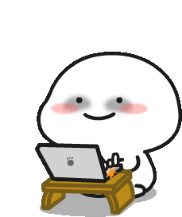

  

  

- I'm a **frontend developer** who is constantly evolving.
- My experience spans various aspects of technology stack development and project execution.
- Feel confident both working independently and in a team.
- Currently studying 21-school from **Sber** (muradint).

Actively participate in various events and hackathons, which allows me to develop not only technical skills, but also soft skills. Recently I took part in a hackathon from **VTB**, where my team won a prize.
